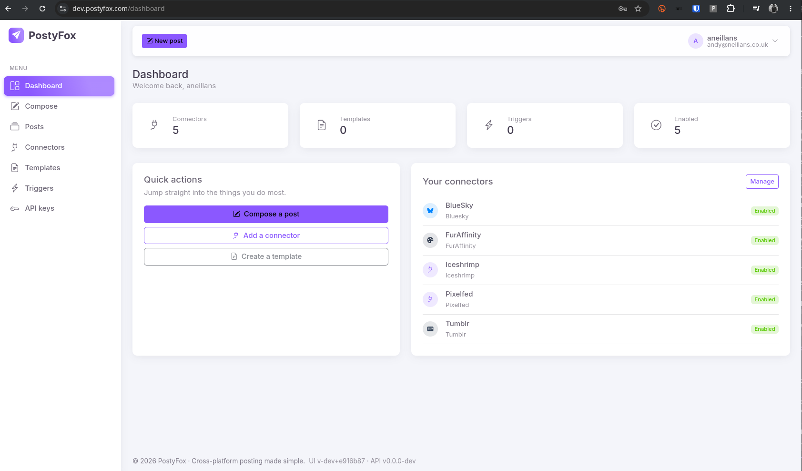

# Adding Connectors

<figure><figcaption></figcaption></figure>

There is no limit to how many connectors you add to your account, or use in a single posting.

At this time, PostyFox currently supports:

* Akkoma
* BlueSky
* Discord (via Webhooks)
* FireFish
* Friendica
* FurAffinity
* GoToSocial
* Hometown
* Iceshrimp
* Mastodon
* Pixelfed
* Pleroma
* Telegram
* Tumblr

_Note: PostyFox will NOT support Twitter / X due to the ... political ... issues around the platform._


Where possible, we will never take a username / password from you to be held on the platform, and instead use things like OAuth which will take a short lived token - which you can revoke at any time.

Connectors such as FurAffinity do not support API's, and we have to resort to degrees of automation to get things to post, and as such, we have a "PostyFox Connect" Browser Plugin for Chrome which securely transfers your authentication cookie to your connector, meaning your actual login details _never_ get passed to us, and indeed, your session naturally expires.&#x20;


To add a new connector to your account after logging in, there are two paths you can follow:

1. Click Connectors on the left, then Add Connector up the top right.\
   -OR-
2. Click Manage in the "Your connectors" box on the right of the Dashboard, then click Add Connector up the top right.

You can test your Connectors can authenticate once you have added (and saved!) them by clicking on the Check Auth button.&#x20;

<figure><figcaption></figcaption></figure>

If things are a-ok, you will see "Authenticated"

<figure><figcaption></figcaption></figure>
